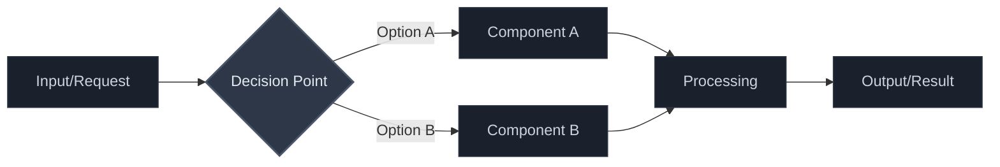

# ADR-000: Tem| Theme | Approach A | Approach B | Overlap | Gaps/Disagreements | Our Takeaway | Insight |
|-------|------------|------------|---------|-------------------|--------------|----------|
| **Theme Name** | How approach A handles this | How approach B handles this | What they share | Where they differ | Our approach | Trade-off modeled |te Format

**Status:** Accepted  
**Date:** YYYY-MM-DD  
**Tags:** [architecture, plugin, provider, data-model]  

## Context

What is the background and problem that this ADR is solving? Include relevant business context, technical constraints, and why this decision is needed now.

## Comparative Analysis

Analysis of industry patterns and approaches relevant to this architectural decision:

| Theme | Industry Pattern A | Industry Pattern B | Overlap | Gaps/Differences | Our Takeaway | Insight |
|-------|-------------------|-------------------|---------|------------------|-------------|---------|
| **Theme Name** | How pattern A solves this | How pattern B solves this | What they share | Where they differ | Our approach | Trade-off modeled |
| **Theme Name** | Pattern description | Pattern description | Commonalities | Differences | Project fit | Key learning |

*Include only themes relevant to this specific decision. Examples: open-source projects, established frameworks, industry standards, documented patterns.*

## Options Considered

### Option 1: [Name]
- **Description:** Brief explanation
- **Pros:** Benefits and advantages
- **Cons:** Drawbacks and limitations
- **Trade-offs:** What we gain vs lose

### Option 2: [Name]
- **Description:** Brief explanation  
- **Pros:** Benefits and advantages
- **Cons:** Drawbacks and limitations
- **Trade-offs:** What we gain vs lose

### Option 3: [Name]
- **Description:** Brief explanation
- **Pros:** Benefits and advantages
- **Cons:** Drawbacks and limitations
- **Trade-offs:** What we gain vs lose

## Decision

We will [chosen option] because [rationale].

**Key factors:**
- Factor 1: explanation
- Factor 2: explanation
- Factor 3: explanation

## Architecture Diagram



## Consequences

### Positive
- Benefit 1: explanation
- Benefit 2: explanation

### Negative  
- Risk 1: explanation and mitigation
- Risk 2: explanation and mitigation

### Neutral
- Change 1: explanation
- Change 2: explanation

## Implementation Rollout

1. **Phase 1:** What gets built first
2. **Phase 2:** What comes next
3. **Phase 3:** Final components

**Dependencies:** What needs to exist before this can be implemented

## Insights

**Trade-off Modeled:** [simplicity vs flexibility | latency vs accuracy | cost vs performance | reversibility vs finality]

**Key Insight:** A 1-2 sentence explanation of what architectural trade-off this decision illustrates and why it fits the project's architectural vision.

**Development Implication:** How this decision specifically impacts development workflow, maintainability, or system behavior.

## System Architecture Impact

> **⚠️ MANDATORY:** Every ADR must assess and document impact on system architecture

**Architecture Diagram Updates Required:** [Yes/No]

**Components Affected:** 
- [ ] Application Layer
- [ ] Service Layer  
- [ ] Data Layer
- [ ] Infrastructure
- [ ] Development Process
- [ ] Other: ___________

**Technology Stack Changes:**
| Category | Previous | New Decision | Rationale |
|----------|----------|--------------|-----------|
| Example | Old Tech | New Tech | Why changed |

**Mermaid Diagram Changes:** 
```mermaid
# Include specific diagram updates needed for /docs/system-architecture.md
# OR state "No diagram changes required"
```

**Update Instructions:** 
- [ ] Update `/docs/architecture.md` diagram
- [ ] Update technology stack table in system-architecture.md
- [ ] Update component relationships if needed
- [ ] Update ADR impact tracking table

## References

- [Related ADR-XXX](#)
## References

- [Link to Industry Analysis]
- [Link to Technical Documentation]

---

*Template Note: Remove this section when using. Each ADR should include relevant architecture reference analysis inline where they inform the decision.*