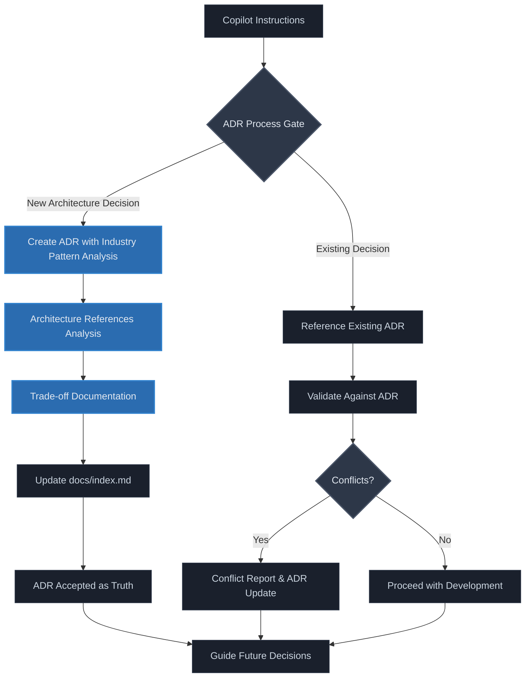

# ADR-001: ADR-First Development and Documentation-Driven Architecture

**Status:** Accepted  
**Date:** 2025-09-19  
**Tags:** [architecture, process, documentation, copilot, governance]  

## Context

This development boilerplate must establish foundational development practices before any project implementation begins. The platform's mission—to provide specification-first development foundation for any software project—requires disciplined architectural decision-making that synthesizes industry best practices while maintaining clear trade-off visibility.

Two critical requirements drive this decision:
1. **Copilot Instructions Integration**: All AI coding agents working on projects using this boilerplate must follow documented patterns in `/.github/copilot-instructions.md` and respect ADR decisions as single source of truth
2. **Industry Pattern Analysis Framework**: Projects must systematically analyze patterns from industry examples and reference implementations to inform design choices without copying code

Without this foundational ADR, future development risks inconsistent decision-making, unclear trade-offs, and misalignment with the project's vision of synthesizing proven patterns into well-reasoned architectural choices.

## Comparative Analysis

Analysis of development practices from inspiration sources:

| Theme | Industry Approach A | Industry Approach B | Overlap | Gaps/Disagreements | Our Takeaway | Insight |
|-------|---------------------|---------------------|---------|-------------------|--------------|----------|
| **Documentation Standards** | Technical depth with contributor guides, explicit version support | User experience focus with official docs sites, community channels | Both emphasize contributor guidance | Different audience focus and technical depth | Embed ADR process in copilot instructions for AI contributors | Documentation serves different audiences but must be authoritative |
| **Development Process** | Community-driven workflows, benchmark results as PRs, issue discussion before large changes | Tool-integrated reporting, issue templates, workflow automation | Both require discussion before major changes | Different automation and feedback mechanisms | ADR-first approach prevents misalignment in development | Process discipline scales better than ad-hoc communication |
| **Architecture Evolution** | Incremental feature additions to existing architectures | Tool evolution with broader workflow integration | Both evolved organically from initial concepts | Different scope and integration focus | Explicit trade-off documentation captures architectural intent | Undocumented architectural evolution leads to complexity debt |

## Options Considered

### Option 1: Lightweight Documentation (Rejected)
- **Description:** Minimal documentation with informal decision tracking
- **Pros:** Faster initial development, less overhead
- **Cons:** No systematic trade-off analysis, unclear architectural intent, copilot confusion
- **Trade-offs:** Development speed vs long-term maintainability and guidance clarity

### Option 2: Standard RFC Process (Rejected)
- **Description:** Traditional RFC workflow with review cycles and approval gates
- **Pros:** Proven in large organizations, thorough review process
- **Cons:** Too heavyweight for most projects, doesn't integrate comparative analysis
- **Trade-offs:** Process rigor vs development velocity and embedded learning

### Option 3: ADR-First with Embedded Industry Pattern Analysis (Accepted)
- **Description:** Architecture Decision Records as single source of truth, with industry pattern analysis table format and copilot instructions integration
- **Pros:** Captures trade-offs explicitly, guides development, synthesizes industry patterns, maintains development velocity
- **Cons:** Requires discipline to maintain, upfront investment in process
- **Trade-offs:** Process investment vs architectural clarity and development effectiveness

## Decision

We will implement **ADR-First Development with Embedded Industry Pattern Analysis** because it directly supports disciplined architectural decision-making while providing clear guidance for development teams and AI coding assistants.

**Key factors:**
- **Development Guidance**: Copilot instructions can reference ADRs as authoritative architectural truth, preventing drift and misalignment
- **Industry Pattern Synthesis**: Industry pattern analysis tables systematically extract insights from architecture references without code copying
- **Trade-off Visibility**: Explicit documentation of architectural trade-offs enables better design decisions
- **Process Scalability**: Documentation-driven development scales across team sizes and project complexity

## Architecture Diagram

## Consequences

### Positive
- **Architectural Consistency**: All decisions documented with clear rationale and trade-offs
- **Development Alignment**: Copilot instructions provide authoritative guidance preventing architectural drift
- **Industry Pattern Learning**: Systematic extraction of best practices from reference architectures
- **Decision Traceability**: Clear audit trail of why specific architectural choices were made
- **Process Scalability**: Documentation-driven approach scales across different project types and sizes

### Negative  
- **Process Overhead**: Each architectural decision requires ADR creation and comparative analysis
- **Maintenance Burden**: ADRs must be kept current as architecture references evolve
- **Initial Velocity Impact**: Upfront investment in process before implementation begins

### Neutral
- **Documentation as Code**: ADRs become part of the development workflow, not separate documentation
- **Learning Investment**: Team must develop skill in comparative analysis and trade-off documentation

## Implementation Rollout

1. **Phase 1: Foundation** 
   - Establish ADR-001 (this document)
   - Update copilot instructions to reference ADR process
   - Create docs/index.md tracking system

2. **Phase 2: Project-Specific ADRs**
   - Technology stack and framework selection
   - Project structure and module organization
   - Development tooling and workflow setup
   - Core architectural patterns and abstractions

3. **Phase 3: Governance Integration**
   - Development validation against ADRs in workflow
   - Conflict detection and resolution process
   - Regular architecture reference updates

**Dependencies:** None - this is the foundational process all other development depends on

## Insights

**Trade-off Modeled:** Process investment vs architectural clarity and development effectiveness

**Key Insight:** Development teams require explicit architectural guidance to maintain consistency and alignment with project vision. ADR-first development provides this guidance while systematically capturing industry best practices through comparative analysis.

**Development Implication:** This decision establishes the meta-architecture for how development teams will understand and contribute to project architecture. Future ADRs will define specific architectural choices, but this ADR ensures all decisions are traceable and aligned with documented architectural intent.

## References

- [Copilot Instructions](/.github/copilot-instructions.md)
- [ADR Template](adr-000-template.md)

---