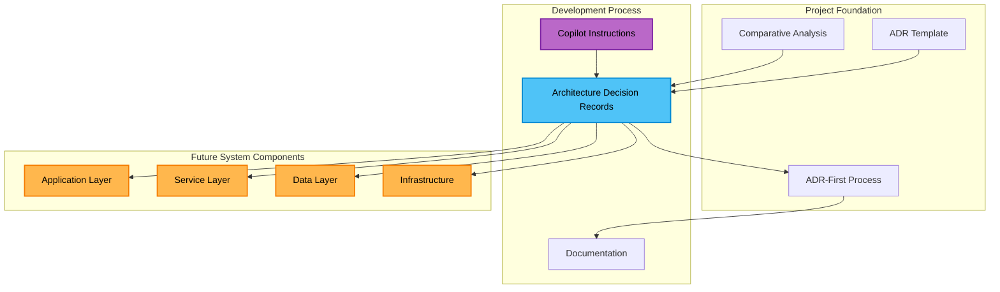

# System Architecture

```mermaid
graph TB
    subgraph "Development Process"
        ADR[Architecture Decision Records]
        CI[Copilot Instructions]
        DOC[Documentation]
    end
    
    subgraph "Project Foundation"
        TEMP[ADR Template]
        PROC[ADR-First Process]
        COMP[Comparative Analysis]
    end
    
    subgraph "Future System Components"
        APP[Application Layer]
        SVC[Service Layer] 
        DATA[Data Layer]
        INFRA[Infrastructure]
    end
    
    ADR --> PROC
    ADR --> APP
    ADR --> SVC
    ADR --> DATA
    ADR --> INFRA
    
    CI --> ADR
    TEMP --> ADR
    COMP --> ADR
    
    PROC --> DOC
    
    style ADR fill:#4fc3f7,stroke:#0288d1,stroke-width:2px,color:#000
    style CI fill:#ba68c8,stroke:#7b1fa2,stroke-width:2px,color:#000
    style APP fill:#ffb74d,stroke:#f57c00,stroke-width:2px,color:#000
    style SVC fill:#ffb74d,stroke:#f57c00,stroke-width:2px,color:#000
    style DATA fill:#ffb74d,stroke:#f57c00,stroke-width:2px,color:#000
    style INFRA fill:#ffb74d,stroke:#f57c00,stroke-width:2px,color:#000
```